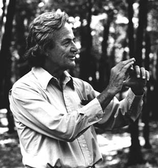



# Please call me Professor Feynman



Richard Feynman, born on May 11, 1918, in Queens, New York, was an American physicist renowned for his contributions to quantum mechanics, quantum electrodynamics, and the field of particle physics. His charismatic personality, insatiable curiosity, and exceptional ability to communicate complex scientific ideas to the general public set him apart as a unique and influential figure in the world of science.

Feynman displayed an early aptitude for mathematics and science, graduating from the Massachusetts Institute of Technology (MIT) with a bachelor's degree in 1939. He continued his education at Princeton University, earning a Ph.D. in physics in 1942. During World War II, Feynman worked on the Manhattan Project, contributing to the development of the atomic bomb.

After the war, Feynman joined the faculty at Cornell University and later moved to the California Institute of Technology (Caltech), where he spent the majority of his academic career. Feynman made significant contributions to the development of quantum electrodynamics, a branch of quantum field theory that describes the electromagnetic force.

Feynman was awarded the Nobel Prize in Physics in 1965, sharing it with Julian Schwinger and Tomonaga Shinichiro for their work in this field. Feynman's diagrams, known as Feynman diagrams, became an essential tool in particle physics for visualizing and calculating particle interactions.

In addition to his groundbreaking research, Feynman was a captivating and enthusiastic teacher. His lectures at Caltech, collected in the three-volume set "The Feynman Lectures on Physics," became legendary for their clarity, insight, and humor. Feynman's ability to convey complex ideas in an accessible manner endeared him to students and the general public alike.

Beyond his scientific pursuits, Feynman had a passion for playing the bongos, exploring the mysteries of nature, and questioning the status quo. He authored several books, including the bestselling "Surely You're Joking, Mr. Feynman!" and "What Do You Care What Other People Think?"

Richard Feynman passed away on February 15, 1988, leaving behind a lasting legacy as a brilliant physicist, charismatic educator, and a curious mind that constantly sought to uncover the beauty and simplicity underlying the complexities of the universe.

# Early years

Richard Feynman was born on May 11, 1918, in Far Rockaway, a neighborhood in Queens, New York. His parents, Melville and Lucille Feynman, instilled in him a love for learning and encouraged his early fascination with science and mathematics.

As a child, Feynman displayed an extraordinary talent for mathematics, and by the age of 15, he had already mastered advanced calculus. He attended Far Rockaway High School, where he was more interested in pursuing his own intellectual interests than conforming to the standard curriculum. Feynman was known for his mischievous and playful nature, often tinkering with radios and other gadgets.

In 1935, at the age of 17, Feynman entered the Massachusetts Institute of Technology (MIT). Despite his unconventional approach to education, he thrived academically, earning his bachelor's degree in physics in 1939. His time at MIT laid the foundation for his future contributions to theoretical physics.

After completing his undergraduate studies, Feynman pursued graduate work at Princeton University, where he obtained his Ph.D. in physics in 1942. World War II was ongoing, and Feynman's expertise in theoretical physics led him to work on the top-secret Manhattan Project at Los Alamos, contributing to the development of the atomic bomb.

Feynman's experiences during this period, as well as his later reflections on the ethical implications of his work on the bomb, influenced his perspective on science and its role in society. After the war, he joined the faculty at Cornell University and then moved to the California Institute of Technology (Caltech) in 1950, where he spent the majority of his academic career.

The early years of Richard Feynman's life were marked by a precocious intellect, a rebellious spirit, and an insatiable curiosity that would shape his later contributions to physics and his unique approach to teaching and communicating complex scientific concepts.

# The Manhatten Project

Richard Feynman's involvement in the Manhattan Project marked a crucial period in his life, as he contributed significantly to the development of the atomic bomb during World War II. In 1941, Feynman was recruited to join the project, a top-secret research and development undertaking aimed at creating the first atomic weapons.

Stationed at Los Alamos, New Mexico, Feynman became part of a brilliant group of scientists working on various aspects of nuclear physics and engineering. His specific role involved calculations related to the behavior of subatomic particles and the dynamics of the bomb's explosion. Feynman's expertise in theoretical physics and his ability to solve complex problems made him a valuable asset to the project.

Feynman's approach to problem-solving was characterized by his unconventional thinking and a knack for finding ingenious solutions. During his time at Los Alamos, he earned a reputation as a charismatic and often humorous figure, endearing himself to his colleagues. Despite the seriousness of the project's goals, Feynman's playful spirit and unconventional methods helped maintain a sense of camaraderie among the scientists.

One of his notable contributions was the development of a method called "Feynman diagrams," which provided a visual representation of particle interactions and greatly aided in understanding complex quantum processes. This technique later became fundamental in the field of particle physics.

Feynman's experiences at the Manhattan Project, while professionally significant, also led him to reflect on the moral and ethical implications of his work. He grappled with the realization that the scientific advancements he contributed to had both destructive and transformative potential.

After the war, Feynman continued his career in physics, ultimately receiving the Nobel Prize in Physics in 1965 for his contributions to quantum electrodynamics. His time at the Manhattan Project played a crucial role in shaping his views on the responsible use of scientific knowledge and the need for ethical considerations in scientific research.

# Legacy

Richard Feynman's lasting legacy is multifaceted, encompassing his contributions to theoretical physics, his innovative teaching methods, and his impact on science communication. Here are some key aspects of Feynman's enduring influence:

1. **Quantum Electrodynamics (QED):** Feynman made significant contributions to the development of quantum electrodynamics, a branch of quantum field theory that describes the interactions between light and matter. His Feynman diagrams provided a visual and intuitive way to understand complex particle interactions, revolutionizing the field and earning him the Nobel Prize in Physics in 1965.

2. **Feynman Diagrams:** The introduction of Feynman diagrams not only streamlined calculations in particle physics but also became a standard tool for physicists worldwide. These diagrams remain a fundamental part of the language of particle physics and have found applications beyond Feynman's original work.

3. **Teaching and Education:** Feynman's impact as a teacher is immeasurable. His engaging lectures at Caltech, captured in "The Feynman Lectures on Physics," continue to inspire students and educators. His emphasis on intuition, visualization, and the joy of discovery has influenced generations of physicists and science enthusiasts. The Feynman method, encouraging a deep understanding of concepts, remains a model for effective science education.

4. **Science Communication:** Feynman was a master communicator, capable of making complex ideas accessible to a broad audience. His books, including "Surely You're Joking, Mr. Feynman!" and "What Do You Care What Other People Think?," offer insights into his life, humor, and perspectives on science. Feynman's ability to bridge the gap between the scientific community and the general public has left an indelible mark on science communication.

5. **Curiosity and Unconventional Thinking:** Feynman's insatiable curiosity, coupled with his willingness to question conventional wisdom, has inspired a mindset of exploration and creativity. His approach to problem-solving, characterized by a playful and unconventional spirit, encourages scientists and learners alike to think outside the box.

6. **Ethics in Science:** Feynman's reflections on the ethical implications of scientific research, particularly his involvement in the Manhattan Project, highlight the importance of considering the broader consequences of scientific advancements. His stance on scientific responsibility and ethics continues to resonate in discussions about the impact of scientific discoveries on society.

Richard Feynman's legacy extends well beyond the confines of academia. His contributions to physics, teaching philosophy, and science communication have left an indelible mark, shaping the way we approach and understand the natural world. Feynman's enduring influence serves as an ongoing source of inspiration for scientists, educators, and enthusiasts worldwide.

### References

1. ChatGPT