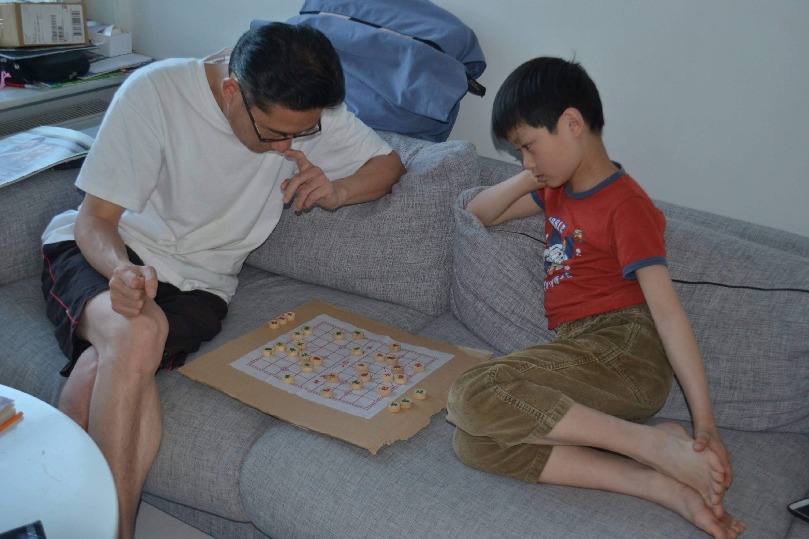
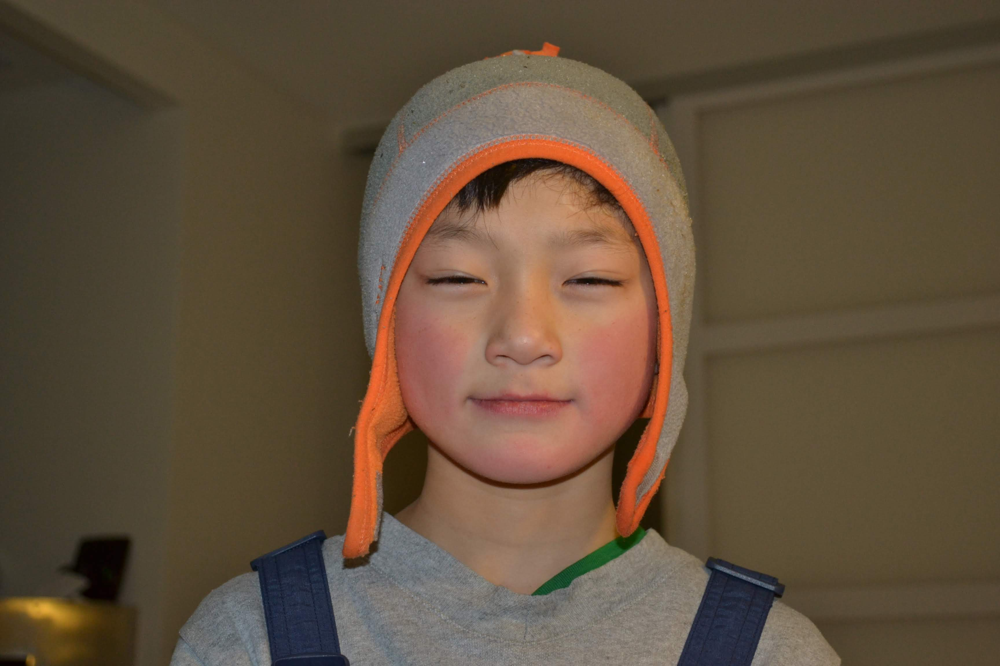


# Chasing Vincent

We moved to Sweden for reasons I can only describe as a "simple twist of fate." We had watched a documentary about Scandinavia and my father happened to receive an offer to work there. That summer after my 2nd grade year, we had packed all our belongings in a few suitcases and migrated to the land of Vikings.

I had already bounced around a few schools before going to an international school where I was in a class of many ethnicities (Sweden took them as refuge). After school, I would go to the local ice-skating rink and "practice" air hockey for hours. Boredom is perhaps the precursor to passion. We went there so often that some hockey players recognized us playing hockey with broomsticks and mops. They gave us some old hockey sticks! From here on out sprung the early passion for sports. A year or so later, I would be able to meet Matts Sundin, a Swedish NFL hockey player. In the summers, we'd learn unicycling and football at sports camps. We'd also take the bus and metro to random cities until the sun starts to set. In the winter months, we'd sled down the local hill where all the local children gathered and occasional snowball fights occurred. Sometimes, we'd snowboard down the little hill in our backyard. For serious adventures, we'd take the bus to the closest ski resort where I got bashed for trying the jumps without a harness. 

At Sweden, I built a homemade lab where I experiemented with basic circuits, toy remote control helicopters, 240V of electricity (didn't know better), sundials, lasers, rocks, explosives, chemicals, and practical jokes. I also made several homemade bows and arrows and slingshots that I'd carry out to the local forest and try to hit birds - I never hit one.
It was here where I'd learn to unicycle, ice-fish, and find myself lost in the world of my own mind.
My father would teach us algebra, trigonometry and chinese chess. 
Almost every night after dinner, our family would stroll to the forest where the you can only hear your own breathe and the river of sounds from the forest.
You'd always come back with hot rosy cheeks.

My parents had gotten my sister, father, and me used bicycles. We rode to a nearby town Vista. Once, we rode back home through a 10 mile forest in literal darkness. We didn't have a flashlight or mobile phones. You only have the light of the moon to vaguely shine through the trees to make out the edges of the trail. A false move would send you tumbling down the rocky hill-side slopes.

For 4th grade, I moved to a new local elementary school called Runan.
It was closer within the city of Sollentuna.
I took on the well-worn role of a new student again.
I remember my friends Elias and Vladimir well.
Like always, I hid away from attention, only surrounding myself with few but trusted friends.
This was the early start of an unsettling feeling. I wasn't truly Swedish. I didn't completely understand their customs or language. There was the beginnings of a lingering feeling that I wasn't one of them.

The play area at this school was built on a small sloped forest, only to be fenced off by roads. We'd play zombies vs. humans with the entire class since there were so many places to hide. Basically, there are a few zombies and the rest are humans. If the zombie tags you, you become a zombie. If by the end of the recess, everyone becomes a zombie, the zombie team wins. Otherwise, the humans win. It was exhilarating to run through the icy cold forest with the adrenaline of animal being hunted down. One time, I fell down onto a rock and hurt my knee pretty bad. I still have that scar on my left knee today. Those young memories lives in that scar.

On my very first day at this school, a guy named Vincent was picking on these girls at the edge of the muddy forest. Immediately, I knew he was an archetypal bully (but really he was just teasing girls like all boys do). With a desire to impress these girls, the strange hero in me started to chase him. He started to run. Pretty soon we were cat-and-mouse running over the sloppy hillside. We ran in circles while a group of classmates cheered me on. Ultimately, he slid down a muddy slope and got all his clothes covered in mud. After his public embarassment, all the classmates congratulated me. A few of the girls he was picking on even complemented me. In a hilariously embarassing way, I had defeated a school bully.



