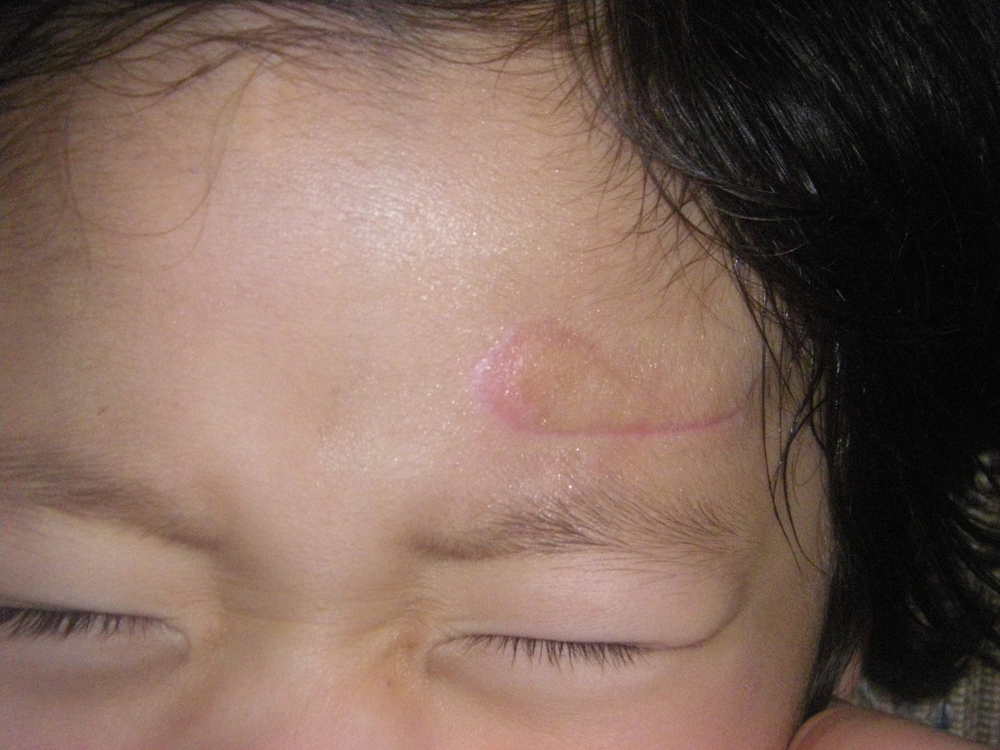



# The boy who lived

Even when I was barely walking, I loved to play with my sister.
In our Californian suburban home I grew up in, I've had plenty of that.
From jump ropes to riding ribsticks, we've had our childhood memories locked away in the cul-de-sac we called our home.

One time, my sister and I were playing tag.
Unfortunately, I also had very bad hand eye coordination as a three year old.
She was much faster than me, and had better control of basic motor skills.
She darted away to the bathroom.
Like a fool, I tried to chased her.
Instead, I ran straight into a wall.
That's how I got my first scar on the bottom of my widow's peak.

On Earth's day before my fifth birthday, the family had made plans go out.
We were having breakfast at our glass dinner table.
We had the sweetly flavored congee my mom used to make.
Baba always added a spicy LaoGanMa sauce despite Mama's complaints.
My dad and my sister were getting ready to go out for a Earth Day event, while I was throwing a tantrum.
Young and foolish.
I was furious that Mama didn't notice through her busy errands.
I grabbed a back of rocks my sister was collecting for her class and pounded them on the glass table which cracked the surface.
Then, without receiving further attention from Mama, I threw my head on the table like a hammer in a fit of rage.

The entire table shattered into a million pieces.
Glass shards were sticking out of my head.
The skull was fractured.

I don't remember what exactly happened from this moment on.
Only that tears had blurred my vision to the point that I don't have clear visual memories.
I'm told you could see the inner flesh and the beating brain ooze.
What I do remember is seeing my father cry for the first time.
In that moment, I stopped crying to show that I wasn't dying.

I got stiches. Of course, everyone canceled their plans for the day.
The doctors made it clear that I'd have a scar on my forehead for my entire life.
Mama was devastated. She thought it'd affect me in my later years.
For years she'd rub retinol capsules on my scar to reduce its transparency.

These scars are forever part of me. A part of me quite likes them.

