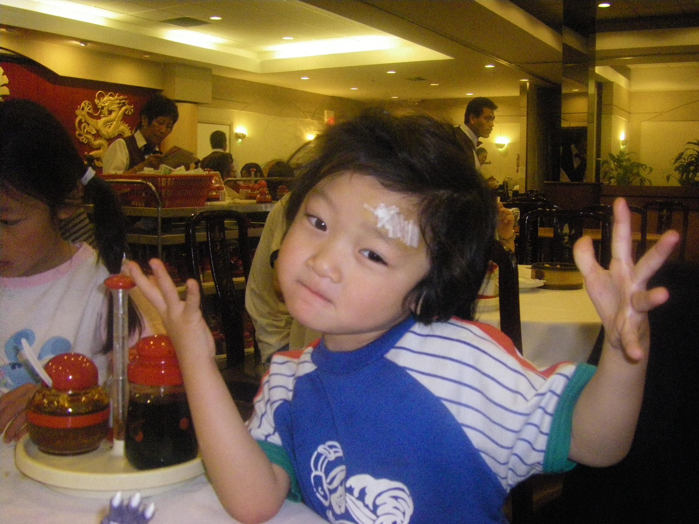



# The boy who lived

I loved to play with my sister.
Unfortunately, I also had very bad hand eye coordination as a 3 year old.
Once we were playing tag and my sister ran to the bathroom.
I chased her.
But I ran into a wall really hard.
That's how I got my first scar on the bottom of my widow's peak.

When I was about 4. It was Earth's day.
I remember my sister got Coca Cola and I didn't. 
We were having breakfast at our glass table.
My dad and my sister were getting ready to go out for a Earth Day event.
I was very frustrated and smashed some rocks my sister had collected on the table, which cracked the glass surface.
Then I used my head and banged it hard on the glass and the entire table shattered. (I sometimes question if this kid has some cognitive impairment. ) Our entire breakfast fell to the ground.
I had glass shards sticking out of my head.
The skull was fractured.
I'm told you could see the inner flesh and the beating brain ooze.
I was rushed to the hospital and I got 8 stitches.

Hence, I'm blessed with these head scars. When people ask me how I got the scar, I just say voldemort came to my house and cursed me.

	
	

Funny enough, years later I got this very story wrong. My parents tell me the story of my scar was from a different reason. My brain had filled in the pieces of my memory from this with a different story!

